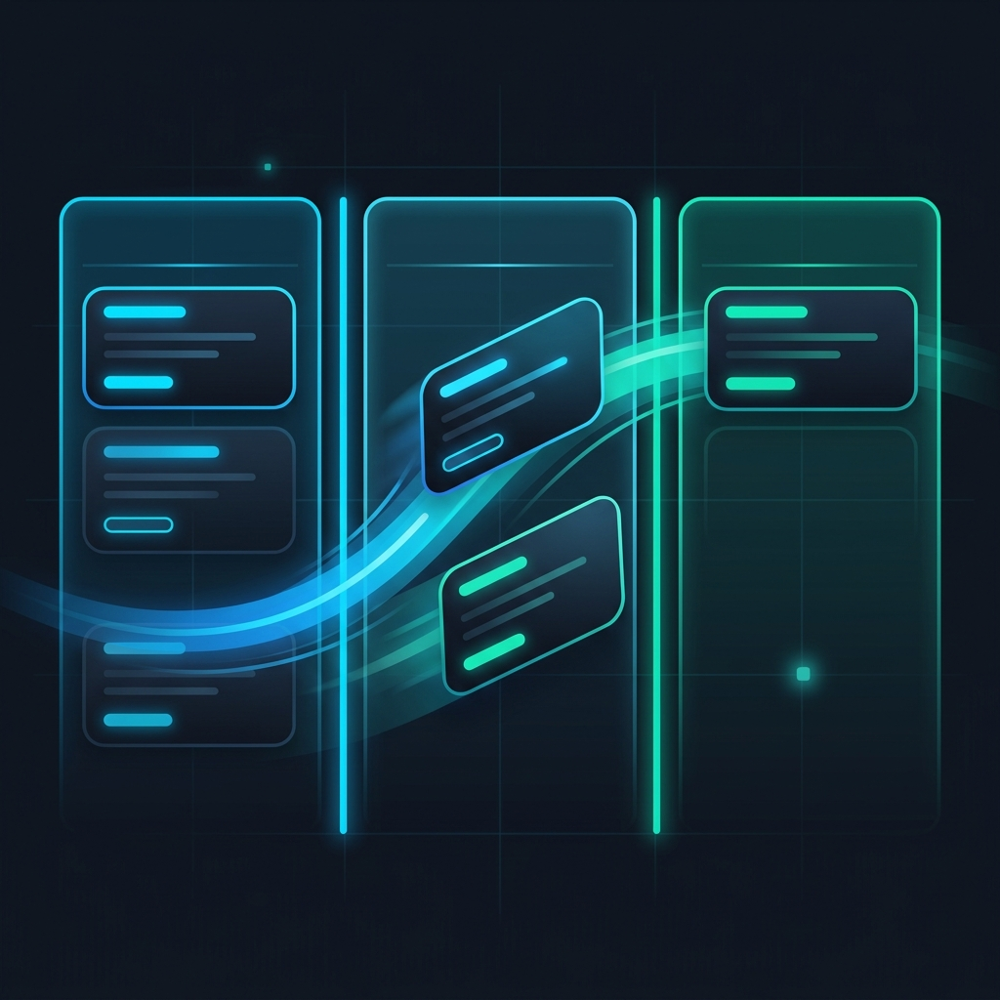
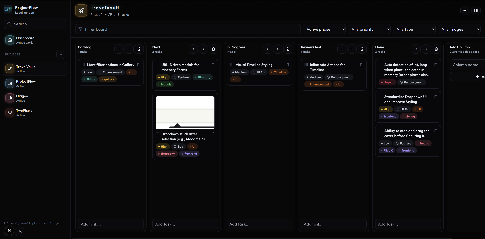

<div align="center">



# ProjectFlow

**Ultra-fast, local-first kanban for AI-assisted tech projects.**

_Open from a desktop icon → see your board → type a task or paste a screenshot → press Enter → keep building._

[](https://nextjs.org/)
[](https://react.dev/)
[](https://www.typescriptlang.org/)
[](https://tailwindcss.com/)
[](https://nodejs.org/api/sqlite.html)
[](https://modelcontextprotocol.io/)


</div>

---

ProjectFlow is a **local-first** project-management web app built for a solo, AI-assisted builder juggling several tech projects at once. It’s a fast kanban backlog for features, bugs, enhancements, UI fixes, screenshots, and implementation ideas — designed around one principle:

> **Capture first. Organize later.**

It doesn’t try to be Jira, Notion, or Trello. It runs entirely on your machine, stores everything in a local SQLite database, and opens from a Windows desktop shortcut so a web app feels like a native one.

## Table of Contents

- [Features](#features)
- [Tech Stack](#tech-stack)
- [Screenshots](#screenshots)
- [Getting Started](#getting-started)
  - [Prerequisites](#prerequisites)
  - [Quick Start](#quick-start)
  - [Windows Setup (recommended)](#windows-setup-recommended)
- [Configuration](#configuration)
- [Usage](#usage)
- [AI Autofill (Gemini)](#ai-autofill-gemini)
- [MCP Server](#mcp-server)
- [Data, Backup & Restore](#data-backup--restore)
- [Project Structure](#project-structure)
- [Scripts](#scripts)
- [Keyboard Shortcuts](#keyboard-shortcuts)
- [Roadmap](#roadmap)
- [Contributing](#contributing)
- [License](#license)

## Features

- 🗂️ **Multi-project kanban** — each project gets its own board with customizable columns (`Inbox → Backlog → Next → In Progress → Review/Test → Done`).
- ⚡ **Frictionless capture** — type a title and hit Enter to create a task in under 3 seconds; no modal, input stays focused for rapid entry.
- 📸 **Screenshot-first workflow** — paste an image from the clipboard (`Ctrl+V`) or drag a file onto the board to create a task with the screenshot attached. Drop an image on an existing card to attach it there.
- 🧱 **Phases** — build projects step-by-step (MVP → Polish → Advanced → …), mark one phase active, and filter the board by phase.
- 🔀 **Drag-and-drop** — reorder within a column or move across columns; status follows the column and order persists instantly (powered by [dnd-kit](https://dndkit.com/)).
- 🏷️ **Rich metadata** — task types (Feature, Bug, Enhancement, UI Fix, Refactor, Research, Idea, AI Prompt, Note), priorities (Low/Medium/High/Urgent), and tags.
- 🤖 **AI autofill** — let Google Gemini suggest a title, description, task type, and tags from your text and/or attached screenshots.
- 🔌 **MCP server** — manage your board programmatically from any [Model Context Protocol](https://modelcontextprotocol.io/) client (e.g. Claude). Create, update, move, and query tasks.
- 🪟 **Desktop-app feel** — generated Windows shortcuts launch the local server (if needed) and open the app in Edge/Chrome app mode. Per-project shortcuts open straight to a board with a custom icon.
- 🎨 **Custom project icons & colors** — built-in icon set, emoji, or uploaded image per project.
- 💾 **Local-first storage** — everything lives in a single SQLite database plus local folders; one-click ZIP **export/import** for backups.
- 🌙 **Dark-mode-first UI** — compact, polished, and responsive, handling hundreds of tasks per project without lag.

## Tech Stack

| Layer        | Technology |
|--------------|------------|
| Framework    | [Next.js 15](https://nextjs.org/) (App Router) + [React 19](https://react.dev/) |
| Language     | [TypeScript 5](https://www.typescriptlang.org/) |
| Styling      | [Tailwind CSS 3](https://tailwindcss.com/) |
| Drag & drop  | [@dnd-kit](https://dndkit.com/) |
| Icons        | [lucide-react](https://lucide.dev/) |
| Database     | Built-in [`node:sqlite`](https://nodejs.org/api/sqlite.html) (no native build step) |
| Backups      | [adm-zip](https://github.com/cthackers/adm-zip) |
| AI           | [Google Gen AI SDK](https://github.com/googleapis/js-genai) (`@google/genai`) |
| Automation   | [Model Context Protocol SDK](https://github.com/modelcontextprotocol/typescript-sdk) |
| Launcher     | PowerShell scripts (Windows) |

## Screenshots

> _Add screenshots or a demo GIF here — drop images into a `docs/` folder and reference them, e.g.:_
>
> ```md
> 
> 
> ```

## Getting Started

### Prerequisites

- **Node.js 22.5+** (Node **24 LTS recommended**) — ProjectFlow uses the built-in `node:sqlite` module, so there’s no native compilation step. On Node 22.5–23.x you may need to enable it with `--experimental-sqlite`.
- **npm** (ships with Node.js).
- **Windows** is required only for the desktop-shortcut/launcher scripts. The web app itself runs anywhere Node.js does.

### Quick Start

```bash
git clone https://github.com/Gaurav-Kumar98/ProjectFlow.git
cd ProjectFlow
npm install
npm run dev
```

Then open **http://127.0.0.1:3344**.

For a production build:

```bash
npm run build
npm run start
```

### Windows Setup (recommended)

The setup script installs dependencies, builds the app, creates the local data folders under `%LOCALAPPDATA%\ProjectFlow`, and adds a **ProjectFlow** desktop shortcut:

```powershell
powershell.exe -NoProfile -ExecutionPolicy Bypass -File setup.ps1
```

…or just double-click **`setup.bat`**. After that, launch ProjectFlow from the desktop icon — no terminal required. The launcher checks whether the server is already running, starts it if not, waits for it to become healthy, and opens it in Edge/Chrome app mode.

## Configuration

| Variable | Default | Description |
|----------|---------|-------------|
| `PROJECTFLOW_DATA_DIR` | `%LOCALAPPDATA%\ProjectFlow` (Windows) / `<cwd>/ProjectFlow` elsewhere | Root folder for the database, attachments, icons, logs, and backups. Set this to isolate dev data. |
| `PORT` | `3344` | Port used by the `dev:local` / `start:local` scripts and the launcher. |

```powershell
# Use an isolated data directory for development
$env:PROJECTFLOW_DATA_DIR = "C:\tmp\ProjectFlow"
npm run dev
```

The **Gemini API key** for [AI autofill](#ai-autofill-gemini) is configured in-app (Settings) and stored in the local database — it is **never** committed to the repo or read from source code.

## Usage

1. **Create a project** from the sidebar. It starts with the six default columns and a default phase.
2. **Capture tasks** — click into a column’s quick-add input, type a title, press **Enter**. Repeat without touching the mouse.
3. **Capture screenshots** — copy an image (e.g. Windows `Win+Shift+S`), focus the board, press **Ctrl+V**, optionally type a title, press Enter. The task is created with the screenshot attached (untitled captures become “Untitled screenshot task”).
4. **Organize** — drag cards between columns, assign type/priority/tags, and group work into phases.
5. **Open the task panel** — click a card for a side panel to edit details, manage attachments, and archive/restore.
6. **Filter & search** across title, description, tags, type, phase, and more.

## AI Autofill (Gemini)

ProjectFlow can use **Google Gemini** to fill in task metadata from whatever context you’ve provided (text and/or attached screenshots).

1. Get an API key from [Google AI Studio](https://aistudio.google.com/app/apikey).
2. Open **Settings** in ProjectFlow and paste the key (stored locally in your SQLite DB).
3. Use the autofill action on a task — Gemini returns a suggested `title`, `description`, `taskType`, and `tags`.

Implemented in [`src/app/api/ai/autofill/route.ts`](src/app/api/ai/autofill/route.ts). If no key is configured, the endpoint returns `401` and AI features stay disabled.

## MCP Server

ProjectFlow ships a [Model Context Protocol](https://modelcontextprotocol.io/) server so AI assistants can manage your board directly. It talks to the same local database over stdio.

**Run it:**

```bash
npm run mcp
```

**Available tools:**

| Tool | Description |
|------|-------------|
| `get_projects` | List all projects |
| `get_phases` | List phases for a project |
| `get_columns` | List columns for a project |
| `get_tasks` | List tasks for a project (optionally filter by column/phase) |
| `get_task` | Get a single task by ID |
| `create_task` | Create a task (title, type, priority, tags, …) |
| `update_task` | Update task fields (including moving columns/phases) |
| `move_task` | Move a task to another column |
| `delete_task` | Archive a task |

**Example client config** (e.g. for Claude Desktop / Claude Code), pointing at this checkout:

```json
{
  "mcpServers": {
    "projectflow": {
      "command": "npx",
      "args": ["tsx", "src/mcp/index.ts"],
      "cwd": "C:\\path\\to\\ProjectFlow"
    }
  }
}
```

Source: [`src/mcp/index.ts`](src/mcp/index.ts).

## Data, Backup & Restore

Everything ProjectFlow stores lives under your data directory (see [Configuration](#configuration)):

```
%LOCALAPPDATA%\ProjectFlow\
├── projectflow.db      # SQLite database (projects, phases, columns, tasks, tags, settings)
├── attachments/        # Uploaded/pasted images
├── icons/projects/     # Per-project icons (incl. generated .ico for shortcuts)
├── backups/            # Exported + pre-import safety backups
└── logs/               # Server/launcher logs
```

- **Export:** produces a single ZIP containing the database and attachments.
- **Import:** restores from a ZIP; the current database is safety-copied to `backups/pre-import-*.db` first.

> ℹ️ This data lives **outside** the repository and is intentionally git-ignored — your tasks, screenshots, and Gemini key never get committed.

## Project Structure

```
ProjectFlow/
├── public/                 # Static assets (logo)
├── scripts/                # Windows launcher & shortcut generators (PowerShell)
├── src/
│   ├── app/                # Next.js App Router (pages + API routes)
│   │   ├── api/            # health, state, projects, phases, columns, tasks,
│   │   │                   #   attachments, files, backup (export/import), ai/autofill
│   │   ├── projects/[projectId]/   # Per-project board route
│   │   ├── layout.tsx
│   │   └── page.tsx        # Dashboard
│   ├── components/         # UI (ProjectFlowApp.tsx + board, panels, etc.)
│   ├── lib/                # db.ts (SQLite + schema/seed), api.ts, types.ts
│   ├── mcp/                # MCP stdio server
│   └── types/              # Ambient types (node:sqlite shim)
├── setup.ps1 / setup.bat   # One-shot Windows setup
├── next.config.ts
├── tailwind.config.ts
└── tsconfig.json
```

## Scripts

| Script | Command | Description |
|--------|---------|-------------|
| `dev` | `npm run dev` | Start the dev server on `127.0.0.1:3344` |
| `dev:local` | `npm run dev:local` | Dev server on `$PORT` (used by the launcher) |
| `build` | `npm run build` | Production build |
| `start` | `npm run start` | Serve the production build on `:3344` |
| `start:local` | `npm run start:local` | Serve production build on `$PORT` |
| `typecheck` | `npm run typecheck` | `tsc --noEmit` |
| `mcp` | `npm run mcp` | Run the MCP server (stdio) |

## Keyboard Shortcuts

| Shortcut | Action |
|----------|--------|
| `Enter` | Save the quick-add task |
| `Ctrl + V` | Paste a clipboard image as a new task / attachment |
| `Ctrl + N` | New task |
| `Ctrl + F` | Search |
| `Esc` | Close the panel/modal |

> Browser shortcuts apply while the ProjectFlow window/tab is focused. A pure web app can’t register a global Windows hotkey — that would require a separate native helper.

## Roadmap

ProjectFlow’s MVP (v0.1–0.6) covers projects, kanban, screenshot capture, desktop shortcuts, the organization layer, and backups. Possible future directions:

- [ ] Demo screenshots / GIFs in this README
- [ ] Cross-platform launcher (macOS/Linux)
- [ ] Checklists on tasks
- [ ] Richer dashboard analytics
- [ ] Automated tests & CI

This project is intentionally **single-user and local-first** — no accounts, no cloud sync, no team collaboration.

## Contributing

This is a personal tool, but issues and pull requests are welcome.

1. Fork and create a feature branch.
2. Make your change and run `npm run typecheck`.
3. Open a pull request describing the change and the motivation.

## License

No license file is included yet, so all rights are reserved by the author by default. If you’d like others to reuse the code, add a `LICENSE` file (e.g. [MIT](https://choosealicense.com/licenses/mit/)).
